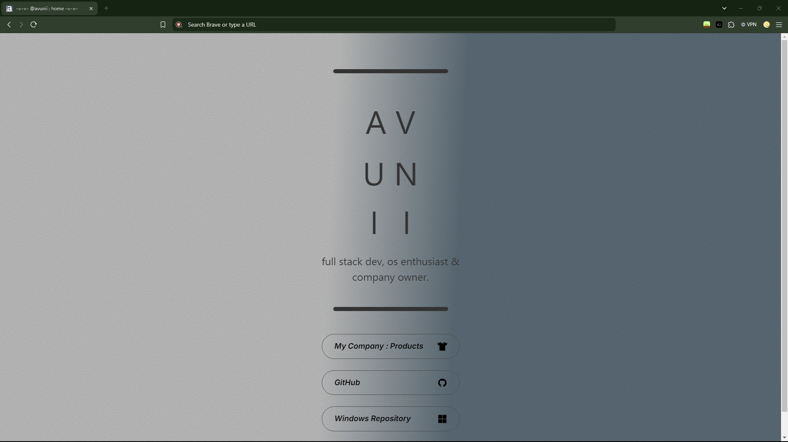
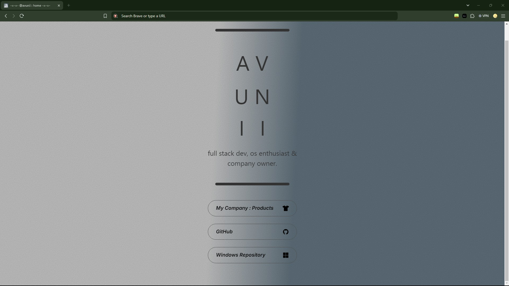

# The Avunii's: Main Website

This is the Main website for the Avunii's GitHub to express all the websites and also link them in unison and harmony.

The assets can be found: [here](https://carrd.co/)

**(Thanks to carrd.co for the Main Website HTML!)**

## Acknowledgements

- Made by: [Alvin Maranx, II ツ (Avun)](https://github.com/avunii/)

- A huge shoutout to my youngest project, on the company account, L-XDT, as of writing this: [Xpotify](https://github.com/l-xdt/xpotify).

- A huge help in this project: [DiffChecker](https://www.diffchecker.com/)

## Authors

- [Alvin Maranx, II ツ (Avun)](https://www.github.com/avunii)

- [carrd.co](https://carrd.co)

## Demo

This is not the Demo, just how you acess it: [here](https://avunii.github.io).

## Features

- Made for dark Mode.

- Custom fonts. (using Inter this time)

- Fullscreen mode.

- Cross platform (for most browsers).

- **PS:** There are a set amount of features for this project so you have to discover more on your own.

## Screenshots





**Written in Vanilla/Plain HTML, CSS and and a little bit of JavaScript.**

## Run Locally

Clone the project, modify it and run it using XAMPP.

```bash
  git clone https://github.com/avunii/avunii.github.io/
```

Go to the project directory

```bash
  cd avunii.github.io
```

Install XAMPP (via Chocalatey, if you don't have it.)

```bash
  chocalatey install xampp
```

Start the server

```bash
  [Directory]/[ServerName]/apache-start.bat
```

## Roadmap

- Additional browser support

- Change the HTML.

- Personalise the code.

- Add your websites.

- Add something new.

- **Written in Vanilla HTML, CSS and Javascript**

## Support

For support, emails: [this one](mailto:avunii@hotmail.com) or [this one](mailto:leidenschaft.tech@hotmail.com) or join our Discord Server: which is not up as of writing this.

## Feedback

This still applies to feedback aswell, Whether you want to give us postive words or neative words, send away (put please only send constructive critisism).

Send away: [here](mailto:avunii@hotmail.com) or [here](mailto:leidenschaft.tech@hotmail.com).

## FAQ

**Now for the official first time on my personal account. My favourite part FAQ!**

#### Can I modify this to fit my needs?

Yeah, sure! That is why we make repositories like these public, for you to tinker and try new things while learning.

#### Can I host this? If I can how?

You can! With my favourite Apache Container, XAMPP. since this is the last (official) repository here is a quick summary:

So, Apache uses 127.0.0.1 which leads back every Windows and Linux, (and some configured macOS) machines, back to itself to host websites, and XAMPP gives it a GUI (Graphical Interface)

Here is a [download](https://www.apachefriends.org/download.html) to it. And if you are struggling with it here is a [tutorial](https://www.youtube.com/watch?v=LzucEZh4_no) (by MainlyWebStuff); and for the novices here is a tutorial on how to self-host a domain: [here](https://www.youtube.com/watch?v=_eQGAJVtRCs) (by Soeng Souy).

## Used By

This project is used by the following companies:

- LeidenSchaft-Xiotim Accquisitions (Limited)

- XDT-Studium.

- Xiotim Development Team [Limited] (XDT).

- XDT-noHesi.

- Oh, yeah, and me!

## Related

Here are some related projects (in order of release date, from this account and my company, L-XDT):

- [Main Website (Personal) - this project.](https://github.com/avunii/avunii.github.io)

- [Xpotify ](https://github.com/l-xdt/xpotify/)

- [Xinder](https://github.com/l-xdt/xinder/)

- [xFlix](https://github.com/l-xdt/xflix/)

- [LinkedX](https://github.com/l-xdt/linkedx/)

- [Main Website (L-XDT)](https://github.com/l-xdt/l-xdt.github.io/)

- [FTP (x-FTP)](https://github.com/l-xdt/ftp/)

- [L-XDT](https://github.com/l-xdt/l-xdt/)

- [Documentation (x-Doc)](https://github.com/l-xdt/documentation/)

- [Phone (xPhone-UI)](https://github.com/l-xdt/phone/)

- [xLinks](https://github.com/l-xdt/xlinks/)

- [XInterest](https://github.com/l-xdt/xinterest/)

- [Xelegram](https://github.com/l-xdt/xelegram/)

- [XApp](https://github.com/l-xdt/xapp/)

- [XCord](https://github.com/l-xdt/xcord/)

- [XChat](https://github.com/l-xdt/xchat/)

- [XGram](https://github.com/l-xdt/xgram/)

- [xSocial](https://github.com/l-xdt/xSocial/)

- [Xirox](https://github.com/l-xdt/xirox/)

- [XioTube](https://github.com/l-xdt/xiotube/)

- [Studium](https://github.com/l-xdt/studium/)

- [XioTok](https://github.com/l-xdt/xiotok/)

- [XioTim](https://github.com/l-xdt/xiotim/)

- [noHesi](https://github.com/l-xdt/no-hesi/)

## Documentation

- This project doesn't really have any good documentation, just a normal understanding of HTML and CSS to understand, (knowing JavaScript is optional, but would be a upperhand).

- But here is the website I took this from, [carrd.co](https://carrd.co), the website itself.

## API Reference

There are no APIs known of, this project only consists of Vanilla HTML, CSS, and a little Javascript, and  one image. No frameworks, if there is, I will update this readMe.

## A little thanks for reading.

**Well! Welcome to my second Chapter of my life on GitHub, here is where everything new from me will be, except for some little changes to the codebase of L-XDT.**
